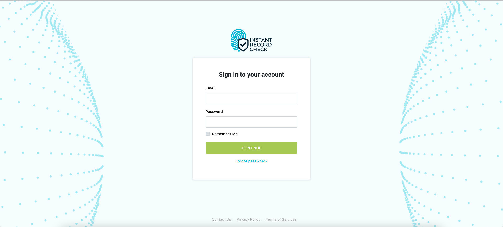

# Instant Record Check: Interview Test

Login form developed in React, JavaScript and SASS.

This app was bootstrapped with create-react-app.

## Steps

1) If you haven't already, download Node.js to access npm tools [here](https://nodejs.org/en/download/)

2) Clone the IRC Interview Test repository
```bash
git clone https://github.com/jonsant0s/InstantRecordCheck-InterviewTest.git
```
3) Once downloaded, open up terminal and go into irc-interviewtest directory
```bash
cd irc-interviewtest
```
4) Install dependencies, I used npm
```bash
npm install
```
5) Now run the application
```bash
npm start
```
this will run in [http://localhost:3000/](http://localhost:3000/)

## Dependencies Used
node-sass: 7.0.0

bootstrap: 5.1.3

## Screenshot

